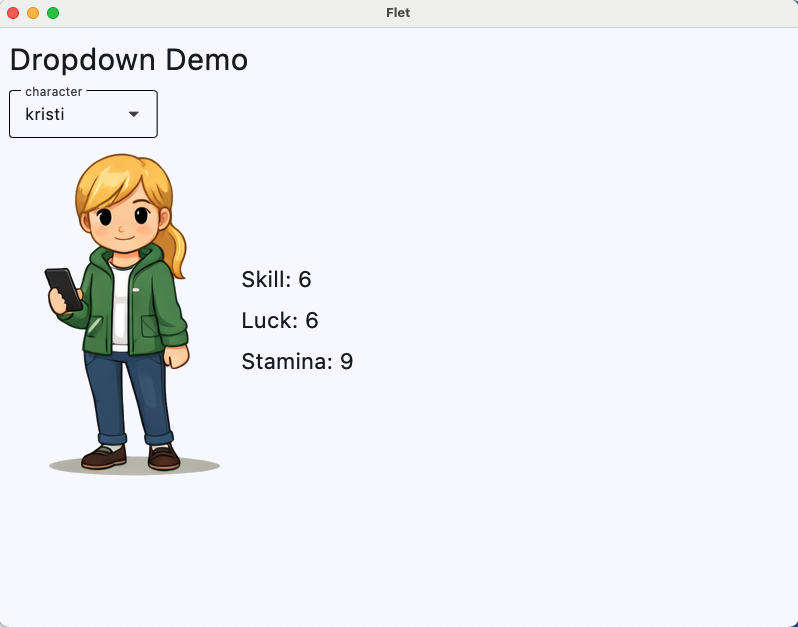
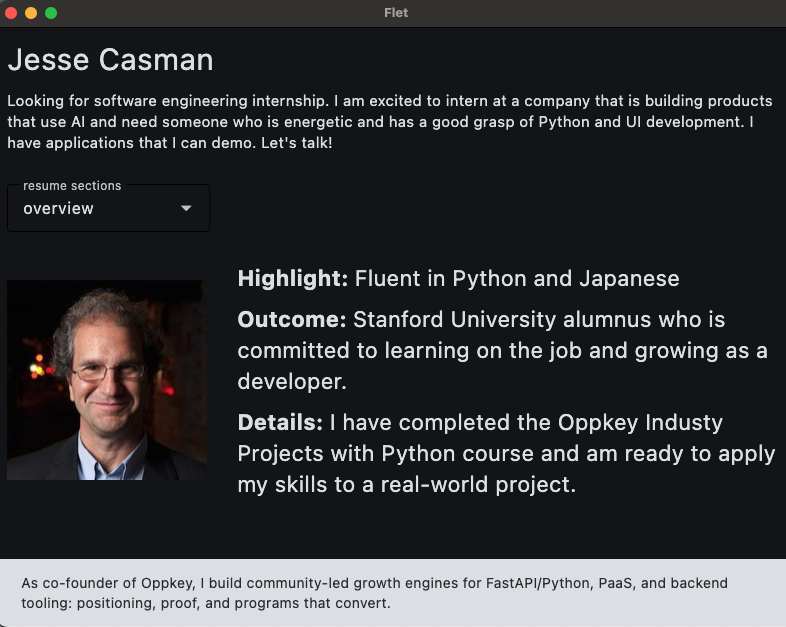
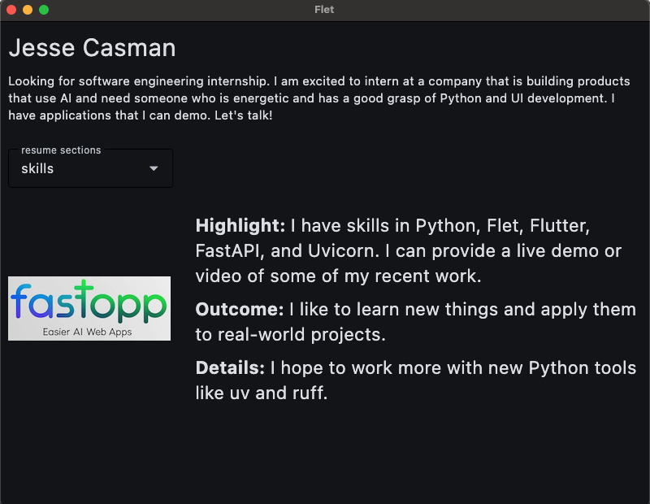

# Oppkey Resume Showcase Template

Based on the Flet Dropdown & Snackbar lessons. This can be found as part of the [Industry Projects with Python course here](https://industry-python.thinkific.com/products/courses/industry-projects-with-python).

The original lessons built a basic drop-down menu in Flet from scratch. You start by creating a new project with uv, pinning a compatible pre-release Flet version, and setting Python to 3.13 (since Flet doesn’t support Python 3.14 yet). After confirming the app runs, you set up a simple `@ft.component` app, render it to the page, and then structure the layout using an `ft.Column` so you can stack a title and the drop-down cleanly.

Next, you add an `ft.Dropdown`, populate it with options using `ft.dropdown.Option`, and verify the control is working in the UI. This gives you a working foundation you can reuse any time you need user selection in a Flat app.

However, with this repo, I took it in a different direction. I used the same app to make a resume for myself. It's a resume that also shows clearly that you know how to use dropdowns and snackbars in Flet applications. Kind of fun. Amazingly easy to do.

## Before



## After, Reworked as a Resume





## Key Lessons from Industry Projects with Python course

1. **38 Flet Dropdown Menu Tutorial (Python 3.13 + uv) | Beginner-Friendly Walkthrough - PYTH 9.02**

2. **39 Python OOP Fundamentals with Flet | Classes, Lists, Dictionaries, and Dropdown Menus PYTH 9.03**

3. **40 Hands-On Flet Tutorial: use_state for Interactive UI with Dropdowns and Objects PYTH 9.04**

4. **41 Understanding use_state in Flet: Declarative State, Rerenders, and UI Updates PYTH 9.05**

5. **42 Hands-On Flet Tutorial: Adding a Snackbar with State and Event Handlers PYTH 9.06**

6. **43 Flet Snackbar Explained: State, Keys, and Non-Blocking Notifications - Lecture 9.07**

## Overview - Flet Dropdown Menu

This tutorial demonstrates:

- Using `ft.Dropdown` for character selection
- Managing state with `ft.use_state`
- Displaying dynamic content based on selection
- Using `ft.SnackBar` to show contextual messages
- Working with dataclasses in Flet applications

## Installation

This project uses `uv` for dependency management. To install dependencies:

```bash
uv sync
```

This will install all dependencies specified in `pyproject.toml`, including Flet.

To run the application:

```bash
uv run flet main.py
```

## Deployment to GitHub Pages

This project is configured for automatic deployment to GitHub Pages using GitHub Actions.

### Automatic Deployment

The repository includes a GitHub Actions workflow (`.github/workflows/deploy.yml`) that automatically builds and deploys the app to GitHub Pages when you push to the `main` branch.

**To enable GitHub Pages:**

1. Go to your repository settings on GitHub
2. Navigate to **Pages** in the left sidebar
3. Under **Source**, select **GitHub Actions**
4. The workflow will automatically run on the next push to `main`

**Manual trigger:**

You can also manually trigger the deployment by:
1. Going to the **Actions** tab in your repository
2. Selecting the **Deploy to GitHub Pages** workflow
3. Clicking **Run workflow**

### Local Build and Testing

To build the web app locally for testing:

```bash
uv run flet build web
```

This creates a `build/web` directory with static files that can be served by any web server. You can test it locally using Python's HTTP server:

```bash
cd build/web
python -m http.server 8000
```

Then open `http://localhost:8000` in your browser.

### Build Output

The build process creates static files in `build/web/` that are suitable for hosting on any static web hosting service, including:

- GitHub Pages
- Netlify
- Vercel
- Any static file server
